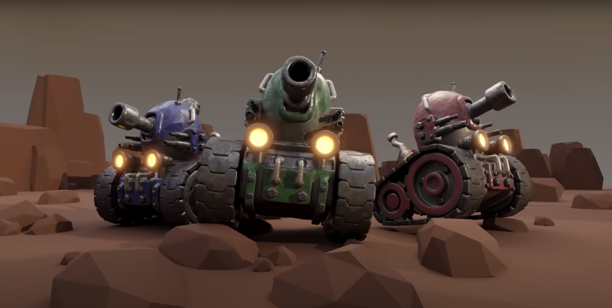

# Make Online Games Using Unity's NEW Multiplayer Framework

-----

### Game Image

Artist: Grant Abbitt

## Design Notes
This project creates a 2D multiplayer tank game using Untity's 2D (URP) game template.  It will be using Unity's gaming services to incorporate multiplayer connection, matchmaking, and teams.

Graphic in this game are provided by [GameDev.TV](https://gamedev.tv) and designed by [Grant Abbitt](https://uk.linkedin.com/in/grant-abbitt?original_referer=https%3A%2F%2Fwww.google.com%2F).

## Results of Course Videos

### Section 1 - Introduction & Setup
- Part 1: Welcome To The Course 

    > Summary: Description of what will be covered in the course
    > - Make Online Unity Course from Scratch
    > - Core Game Play - Player Movement and Environment Interaction
    > - Unity Gaming Services - Multiplayer, Authentication, and Lobbies 
    > - Advanced Game Play - Leaderboard, Respawning, Radar, Bounties, and Healing Pads
    > - Advance Unity Gaming Services - Dedicated Hosting Server, Match Making, and Teams

 

- Part 2: Set Up Unity & VS Code  

    > Summary: Install and Configure Software to Develop Game
    > - Unity Hub
    > - Unity Editor 2022.2.6f1 is the stable version used in course
    > - Visual Studio w/Extensions
    >   - Microsoft C#
    >   - Unity Code Snipets
    > - Set Unity to use VS Code as Editor

 

- Part 3: Networking Basics 

    > Summary: Basics of Unity Netcode
    > - (netcode documentation)[docs-multiplayer.unity3d.com/netcode/current/about]
    >   - Multiplayer Networking Terminology
    >   - Lag Conceptual Knowledge
    >   - Configuration
    >   - Listen Server and Host architecture
    > - Client-Server Model (Self-Hosted)
    > - Client-Server Model (Dedicated)

 
 

- Part 4: Installation & Setup 
 
    > Summary: Setup Unity and Testing Sample
    > - Install Unity Editor 2022.2.6f1
    > - Create Project
    > - Add Networking Packages
    >   - NetCode for GameObjects
    >   - Multiplayer
    >   - MatchMaker
    >   - Cinemachine
    >   - Input System
    > - Create Sample Project
    >   - Add Network Manager
    >       - Handles Player Connecting
    >       - Handles Server Setup
    >       - Handles Connection Approval
    >       - Handles Transpor (data transmission)
    >       - Network Prefabs
    >   - Add Unity Transport (in Network Manager)
    >   - Add Player (Test Object)
    >       - Sprite
    >       - Network Object (Used to assign object to a player session)
    >   - Add Button (Join Session)
    >       - Join C# Script
    >       - Link Script Callback

 
 

&nbsp;&nbsp;&nbsp;&nbsp;&nbsp;&nbsp;&nbsp;&nbsp;&nbsp;&nbsp;&nbsp;

- Part 5:Community & Support 
 
    > Summary: Lists options for community support

 
 

- Part 6: Accessing Our Projects 
 
    > Summary: Lorem ipsum dolor sit amet
    > - consectetur adipiscing elit
    > - sed do eiusmod tempor incididunt ut labore et dolore magna aliqua

 
 

&nbsp;&nbsp;&nbsp;&nbsp;&nbsp;&nbsp;&nbsp;&nbsp;&nbsp;&nbsp;&nbsp;

### Section 2 - Core Gameplay

- Part 1: Section Intro - Core Gameplay 
 
    > Summary: Lorem ipsum dolor sit amet
    > - consectetur adipiscing elit
    > - sed do eiusmod tempor incididunt ut labore et dolore magna aliqua

 
 

&nbsp;&nbsp;&nbsp;&nbsp;&nbsp;&nbsp;&nbsp;&nbsp;&nbsp;&nbsp;&nbsp;

- Part 2: Importing Assets 
 
    > Summary: Lorem ipsum dolor sit amet
    > - consectetur adipiscing elit
    > - sed do eiusmod tempor incididunt ut labore et dolore magna aliqua

 
 

&nbsp;&nbsp;&nbsp;&nbsp;&nbsp;&nbsp;&nbsp;&nbsp;&nbsp;&nbsp;&nbsp;

- Part 3: Reading Input 
 
    > Summary: Lorem ipsum dolor sit amet
    > - consectetur adipiscing elit
    > - sed do eiusmod tempor incididunt ut labore et dolore magna aliqua

 
 

&nbsp;&nbsp;&nbsp;&nbsp;&nbsp;&nbsp;&nbsp;&nbsp;&nbsp;&nbsp;&nbsp;

- Part 4: Network Authority 
 
    > Summary: Lorem ipsum dolor sit amet
    > - consectetur adipiscing elit
    > - sed do eiusmod tempor incididunt ut labore et dolore magna aliqua

 
 

&nbsp;&nbsp;&nbsp;&nbsp;&nbsp;&nbsp;&nbsp;&nbsp;&nbsp;&nbsp;&nbsp;

- Part 5: Player Movement 
 
    > Summary: Lorem ipsum dolor sit amet
    > - consectetur adipiscing elit
    > - sed do eiusmod tempor incididunt ut labore et dolore magna aliqua

 
 

&nbsp;&nbsp;&nbsp;&nbsp;&nbsp;&nbsp;&nbsp;&nbsp;&nbsp;&nbsp;&nbsp;

- Part 6: Player Aiming 
 
    > Summary: Lorem ipsum dolor sit amet
    > - consectetur adipiscing elit
    > - sed do eiusmod tempor incididunt ut labore et dolore magna aliqua

 
 

&nbsp;&nbsp;&nbsp;&nbsp;&nbsp;&nbsp;&nbsp;&nbsp;&nbsp;&nbsp;&nbsp;

- Part 7: Networked Projectiles 
 
    > Summary: Lorem ipsum dolor sit amet
    > - consectetur adipiscing elit
    > - sed do eiusmod tempor incididunt ut labore et dolore magna aliqua

 
 

&nbsp;&nbsp;&nbsp;&nbsp;&nbsp;&nbsp;&nbsp;&nbsp;&nbsp;&nbsp;&nbsp;

- Part 8: Firing Projectiles 
 
    > Summary: Lorem ipsum dolor sit amet
    > - consectetur adipiscing elit
    > - sed do eiusmod tempor incididunt ut labore et dolore magna aliqua

 
 

&nbsp;&nbsp;&nbsp;&nbsp;&nbsp;&nbsp;&nbsp;&nbsp;&nbsp;&nbsp;&nbsp;

- Part 9: Health Component 
 
    > Summary: Lorem ipsum dolor sit amet
    > - consectetur adipiscing elit
    > - sed do eiusmod tempor incididunt ut labore et dolore magna aliqua

 
 

&nbsp;&nbsp;&nbsp;&nbsp;&nbsp;&nbsp;&nbsp;&nbsp;&nbsp;&nbsp;&nbsp;

- Part 10: Health Display 
 
    > Summary: Lorem ipsum dolor sit amet
    > - consectetur adipiscing elit
    > - sed do eiusmod tempor incididunt ut labore et dolore magna aliqua

 
 

&nbsp;&nbsp;&nbsp;&nbsp;&nbsp;&nbsp;&nbsp;&nbsp;&nbsp;&nbsp;&nbsp;

- Part 11: Dealing Damage 
 
    > Summary: Lorem ipsum dolor sit amet
    > - consectetur adipiscing elit
    > - sed do eiusmod tempor incididunt ut labore et dolore magna aliqua

 
 

&nbsp;&nbsp;&nbsp;&nbsp;&nbsp;&nbsp;&nbsp;&nbsp;&nbsp;&nbsp;&nbsp;

- Part 12: Coins 
 
    > Summary: Lorem ipsum dolor sit amet
    > - consectetur adipiscing elit
    > - sed do eiusmod tempor incididunt ut labore et dolore magna aliqua

 
 

&nbsp;&nbsp;&nbsp;&nbsp;&nbsp;&nbsp;&nbsp;&nbsp;&nbsp;&nbsp;&nbsp;

- Part 13: Coin Wallet 
 
    > Summary: Lorem ipsum dolor sit amet
    > - consectetur adipiscing elit
    > - sed do eiusmod tempor incididunt ut labore et dolore magna aliqua

 
 

&nbsp;&nbsp;&nbsp;&nbsp;&nbsp;&nbsp;&nbsp;&nbsp;&nbsp;&nbsp;&nbsp;

- Part 14: Coin Spawner 
 
    > Summary: Lorem ipsum dolor sit amet
    > - consectetur adipiscing elit
    > - sed do eiusmod tempor incididunt ut labore et dolore magna aliqua

 
 

&nbsp;&nbsp;&nbsp;&nbsp;&nbsp;&nbsp;&nbsp;&nbsp;&nbsp;&nbsp;&nbsp;

- Part 15: Map Design 
 
    > Summary: Lorem ipsum dolor sit amet
    > - consectetur adipiscing elit
    > - sed do eiusmod tempor incididunt ut labore et dolore magna aliqua

 
 

&nbsp;&nbsp;&nbsp;&nbsp;&nbsp;&nbsp;&nbsp;&nbsp;&nbsp;&nbsp;&nbsp;

- Part 16: Combat Polish 
 
    > Summary: Lorem ipsum dolor sit amet
    > - consectetur adipiscing elit
    > - sed do eiusmod tempor incididunt ut labore et dolore magna aliqua

 
 

&nbsp;&nbsp;&nbsp;&nbsp;&nbsp;&nbsp;&nbsp;&nbsp;&nbsp;&nbsp;&nbsp;

### Section 3 - Connecting Online

### Section 4 - Gameplay Additions

### Section 5 - Online Matchmaking

### Setcion 6 - Multiplayer Teams